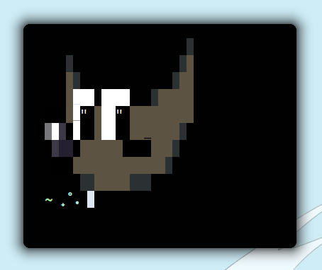

<div align="center">
  <pre style="background: none !important;white-space: nowrap!important;font-weight:bold!important;">
             .,-:;//;:=,                
          . :H@@@MM@M#H/.,+%;,          
       ,/X+ +M@@M@MM%=,-%HMMM@X/,       
     -+@MM; $M@@MH+-,;XMMMM@MMMM@+-     
    ;@M@@M- XM@X;, -+XXXXXHHH@M@M#@/.   
  ,%MM@@MH ,@%=            .---=-=:=,.  
  =@#@@@MX .,              -%HX$$%%%+;  
 =-./@M@M$                  .;@MMMM@MM: 
 X@/ -$MM/                    .+MM@@@M$ 
,@M@H: :@:                    . =X#@@@@-
,@@@MMX, .                    /H- ;@M@M=
.H@@@@M@+,                    @MM+..%#$.
 /MMMM@MMH/.                  XM@MH; =; 
  /%+%$XHH@$=              , .H@@@@MX,  
   .=--------.           -%H.,@@@@@MX,  
   .%MM@@@HHHXX$$$%+- .:$MMX =M@@MM%.   
     =XMMM@MM@MM#H;,-+HMM@M+ /MMMX=     
       ,:+$+-,/H#MMMMMMMMM@= =,         
             =++%%%%+/:-.               
<br>
$ echo 'An useless but fun way to show text-based art!'</pre>
</div>

<p align="center"><b>Let's revive the ASCII art!</b></p>

<p align="center">Nincat is community-driven project that loads an ASCII art centred in your terminal.</p>

---

<p align="center">
  <a href="http://asciiartist.com/wp/respect-ascii-artists-campaign/">
    
  </a>
  <a href="https://github.com/ninecath/">
    
  </a>
</p>

### Features:
+ Fast as it can be and lightweight.
+ Self adapt with the terminal size to print only ASCII arts that fit.
+ Supports any external program such as lolcat.
+ Supports HEX colour foreground/background arts and 256 colours, 88 colours, 16 colours.
+ Skip empty ASCII art files.
+ You can select an art directly (by option).
+ List all ASCII art's paths (by option).
+ Print the name of printed art (by option).
+ Modular folder containing the ASCII arts.

---

### Installing

<!--
#### Arch Linux (Manjaro, Artix, Arco...)

With an AUR helper, you can install it with the package called `nincat-git`.
Example with [paru](https://github.com/Morganamilo/paru):

```zsh
# paru -S nincat-git
$ nincat --random --center
```
-->

#### By Github

Click in `Code` in this repository and then `Download ZIP`. Extract it using your favourite tool and then in your terminal: 
```nu
> cd PUT_HERE_THE_PATH_OF_NINCAT
> nincat random
```

#### By Git

From your terminal, you can clone in your preferred folder:
```nu
> git clone 'https://github.com/ninecath/nincat'
> cd nincat
> use ./nincat.nu
> nincat random
```

----

### Tips

<!--
#### List all arts.

Some people may like or not a few arts, to remove you either take out the ASCII art-file or add it into a list to ignore it on `./ignore.txt`.

For example, if you don't like the Portal's ASCII art, just add the path to it!

```
....../nincat/ascii_arts/games/portal 19 40
```

Then run this again to update the list.

```nu
> nincat setup
```
-->

#### Loading when your terminal emulator open.

That is, when your shell is loaded. There are many shells out there, a very famous one is `bash`.

Anyway, all you need to do is add one line in your shell-r that runs nincat, then you'll be able to load it when the terminal opens :)

To verify what shell-rc you should have, run `$env.SHELL` or `echo $SHELL` (POSIX) in your terminal.

+ For `zsh` the	rc is put in `~/.zshrc`;
+ For `bash` the rc is put in `~/.bashrc`;
+ For `fish` the config is put in `~/.config/fish/config.fish`;
+ For `nu` the config is put in `~/.config/nushell/config.nu`.

```nu
> nincat random
```

#### Creating ASCII/ANSI/TEXT-BASED art.

Tools that can be used to make easier this type of art can be found on Internet, here's a few of them:

<!--
Tools:
+ [ninecath.github.io](https://github.com/ninecath/ninecath.github.io/) **[web]**
+ ...
-->

**Colours***

[Give a look at this site for **256, 88, 16 colours** in your ASCII arts](https://misc.flogisoft.com/bash/tip_colors_and_formatting).
And obviously, you should utilize `\033` instead of `\e`.

For RGB colours, [I'd recommend this lecture-commentary](https://stackoverflow.com/questions/4842424/list-of-ansi-color-escape-sequences).


----

<p align="center">
  
</p>

### Contributing/Adding ASCII arts:

File names are made in this format: `<name-of-art>`.
The spaces are important since we use them to rule out what arts should be printed.

The art files are put in the [`/assets/`](./assets). You can make a separate folder to add your own arts. Of course, update the list after with:
```she
$ nincat setup
```

Please, do not fill all the lines with spaces to close all columns. A good and simple example should be:
And do not use tabs, instead you should use spaces.
```
# Your wonderful username/name and/or extra information about authority (author).
   (   )
: ) o_o ( :
```

**Please, contribute!**

It would be lovely that for every art you add, you add it here, too! Remember to put your name in the first line, so your contribution is never forgotten :)

- By Github's Pull Request (recommended)

Clone this project, add your art in a file in either manually with **Github** or with **git**, then send a pull request here comparing both branches.

- By Github's Issue

Create a new issue in the `New art` type of issue and put your art there.

----

### Dependencies:
+ **nushell**
<!--
+ **lolcat** (optional)
  - [You can use its faster implementation](https://github.com/jaseg/lolcat) for performance.
  - You can disable this dependency by just renaming the `/ascii_arts/   _   lolcat` folder to anything else without the prefix `   _   ` in the root directory of `nincat`.
+ **gay** (optional)
  - [source](https://github.com/ms-jpq/gay)
  - You can disable this dependency by just renaming the `/ascii_arts/   _   gay` folder to anything else without the prefix `   _   ` in the root directory of `nincat`.
-->

---

### Acknowledgements:

You can find alternatives in the web, here are some with their initial commits:

+ [ASCII Art](https://github.com/Tianwei-Li/ascii_art) (2013/02);
+ [ShASCII](https://github.com/oskargicast/shascii) (2014/05);
+ [Art Splash Screen](https://github.com/DanCRichards/ASCII-Art-Splash-Screen) (2017/11);
+ Inspired by [shell-colors-scripts](https://gitlab.com/dwt1/shell-color-scripts/) (2018/02);
+ [TerminalWelcome](https://github.com/devarshi16/TerminalWelcome) (2019/03);
+ [pokemon-colorscripts](https://gitlab.com/phoneybadger/pokemon-colorscripts/) (2021/08).

---

<p align="center">
  <a href="/LICENSE"><b>GPL3 License</b></a>
</p>
